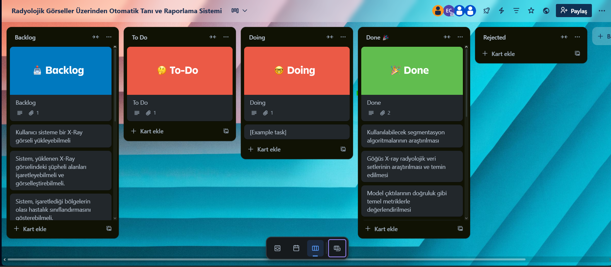

# Takım İsmi
⚡ AI Takım 83 ⚡

# Takım Üyeleri

| İsim | Rol                 |  Sosyal Medya                                                                          |
| :------- | :--------------------------------------- | :--------------- |
| Esra Cesur | Product Owner     |   |
| İclal Karahisar         |   Scrum Master    |    |
| Atakan Emir Çaldağ    | Developer        |      |
| Emir Can İpsalalı       | Developer        |  |

---

# Ürün Açıklaması

Bu proje, radyolojik görüntüler üzerinden semptom ve anomali bölgelerini otomatik olarak algılayıp görselleştiren, ardından tespit edilen bulguları doğrudan tıbbi rapora dönüştüren entegre bir yapay zeka destekli tanı ve karar destek sistemidir. Sistem, radyolojik görüntülerdeki hastalıkla ilişkili alanları öne çıkararak doktorların dikkatini kritik bölgelere yöneltecek, böylece yoğun iş yükü ve dikkat dağınıklığı gibi nedenlerle gözden kaçabilecek önemli bulguların fark edilmesini kolaylaştıracaktır.

Modelin tespit ettiği bulgular otomatik olarak raporlanacak ve manuel raporlama ihtiyacını ortadan kaldırarak zaman tasarrufu ve rapor standardizasyonu sağlanacaktır. Ayrıca, LLM tabanlı bir asistan, doktorlara alternatif teşhis olasılıkları, hasta yönlendirmeleri ve tedavi seçenekleri hakkında ikinci görüş sunarak karar alma süreçlerine yardımcı olacaktır. Bu sistem, doktorun nihai kararını destekleyen, ikinci görüş sunan bir araç olarak konumlandırılmıştır.

## Ana Hedefler:

- **Otomatik Anomali Tespiti:** Radyolojik görüntülerdeki hastalıkla ilişkili bölgeleri otomatik olarak tespit etme
- **Görsel Rehberlik:** Tespit edilen bölgelerin görüntüler üzerinde görselleştirilmesi ile kritik bulgulara dikkat çekme 
- **Akıllı Raporlama:** Tespitleri anlamlı ve detaylı tıbbi raporlara dönüştürme
- **Standardizasyon:** Raporlama süreçlerinde tutarlılık ve şeffaflık sağlama
- **Karar Desteği:** LLM yardımı ile alternative teşhis olasılıkları ve tedavi önerilerinde ikinci görüş sağlama

**Not:** Sistem nihai karar verici değil, doktor kontrolünde çalışan bir yardımcı araçtır.

## Hedef Kitle:

**Birincil Kullanıcılar:**
- Radyolog Doktorlar: Görüntüleri okuyup yorumlayan, tanı koyan ve rapor yazan uzman doktorlar
- Radyoloji Asistanları: Uzmanlık eğitimi alan, görüntü yorumlama deneyimi kazanmak isteyen genç radyolog doktorlar

**İkincil Kullanıcılar:**
- Ortopedistler ve Diğer Branş Doktorları: Kendi alanlarındaki görüntülemelerde detaylı analiz isteyen uzmanlar
- Acil Tıp Doktorları: Radyolog yokluğunda acil durumlarda hızlı ön değerlendirme yapmak zorunda kalan klinisyenler

**Kurumsal Kullanıcılar:**
- Devlet Hastaneleri
- Özel Hastaneler

**Eğitim ve Araştırma:**
- Tıp Fakülteleri
- Araştırmacılar

---

## Neden Bu Platforma İhtiyaç Var?

- Artan İş Yükü ve Zaman Kısıtlılığı
- İnsan Hatası Riski
- Standardizasyon Eksikliği

---

# Product Backlog URL

[AI Takım 83 Trello Backlog Board](https://trello.com/b/zEVe7Gs3/radyolojik-gorseller-uzerinden-otomatik-tani-ve-raporlama-sistemi)

---

#  Sprint 1

## Sprint Notları
Sprint süresince yapılması planlanan görevler backlog içerisine tanımlanmıştır.  
Projenin temel yapısı oluşturulmuştur.

---

##  Sprint Puanları

- **Toplam Backlog Puanı:** 340 puan  
- **Sprint 1 Hedefi:** 100 puan

**Sprint 1 içeriği:**
- Altyapı kurulumu  
- Veri toplama  
- İlk model eğitimi  
- İlk arayüz tasarımı

---

## 🗣 Daily Scrum

Günlük scrum toplantılarımız **WhatsApp grubu üzerinden yazılı olarak** gerçekleştirilmiştir.  
Her gün ekip üyeleri tarafından:

-  Bir önceki gün yapılan işler  
-  O gün planlanan görevler  
-  Karşılaşılan engeller veya ihtiyaç duyulan destekler  

belirli bir formatla gruba aktarılmıştır.

🗂 **Günlük konuşma kayıtları:**  
📄 [daily.pdf](Documentation/daily.pdf)

---

##  Sprint Board

---

## Ürün Durumu (Ekran Görüntüleri)

---

##  Sprint Review

- Göğüs X-ray verileri başarıyla toplanmış ve analiz edilmiştir.
- Veriler üzerinde, hastalıklı ve sağlıklı etiketlerine göre bir ikili (binary) sınıflandırma modeli geliştirilmiştir.
- Hastalıklı olarak etiketlenmiş veriler üzerinde çok sınıflı (multi-class) sınıflandırma modeli bulunmuştur.  
- Görselleştirme ve anomali işaretleme bir sonraki sprint'e ertelendi.  
- Raporlama için Gemini entegrasyonu planlandı fakat henüz başlatılmadı. Prompt yapıları Sprint 2’ye aktarılmıştır.  
- Sistem, ileride farklı vücut bölgelerini analiz edebilecek şekilde genişletilebilir.
- Web sitesine yönelik genel bir kullanıcı arayüzü tasarımı gerçekleştirildi.

 **Sprint Review Katılımcıları:**
- Esra Cesur  
- İclal Karahisar  
- Atakan Emir Çaldağ  
- Emir Can İpsalalı

---

## Sprint Retrospective

- Toplantı zamanları belirlendi.  
- Takım içi görev dağılımları yapıldı.

---

#  Sprint 2

## Sprint Notları
Sprint 2 kapsamında model geliştirme çalışmaları devam ettirilmiş, görselleştirme ve göğüs X-ray görüntülerinin sınıflandırılması yapılmıştır.  
Ayrıca, sistemin hem frontend hem de backend tarafında geliştirme çalışmaları gerçekleştirilmiştir.

---

##  Sprint Puanları

- **Toplam Backlog Puanı:** 340 puan  
- **Sprint 2 Hedefi:** 120 puan

**Sprint 2 içeriği:**
- Ana modellerin eğitimi  
- Görselleştirme çıktılarının alınması  
- LLM destekli raporlama sistemine başlangıç  
- Frontend ve backend geliştirmeleri  

---

## 🗣 Daily Scrum

Günlük scrum toplantılarımız **WhatsApp grubu üzerinden yazılı olarak** gerçekleştirilmiştir.  

🗂 **Günlük konuşma kayıtları:**  
📄 [daily2.pdf](Documentation/daily2.pdf)

---

##  Sprint Board

---

## Ürün Durumu (Ekran Görüntüleri)

---

##  Sprint Review

- Göğüs X-ray verileri sınıflandırılarak analiz edilmiştir.  
- Görselleştirme çıktıları başarıyla alınmış ve yorumlanmıştır.  
- LLM entegrasyonu başlatılmıştır (rapor üretimi için prompt çalışmaları yapılmıştır).  
- Hastalıklı olarak etiketlenmiş veriler üzerinde çok sınıflı (multi-class) sınıflandırma modeli eğitilmiştir.  
- Raporlama sistemine yönelik prototipleme süreci başlatılmıştır.

**Sprint Review Katılımcıları:**
- Esra Cesur  
- İclal Karahisar  
- Atakan Emir Çaldağ  
- Emir Can İpsalalı

---

## Sprint Retrospective

- Görselleştirme çıktıları, model doğruluğuyla tutarlı şekilde başarılı sonuçlar verdi.  
- Bir sonraki sprintte sistem entegrasyonu ve demo yayınına ağırlık verilecek.

