# Takım İsmi
⚡ AI Takım 83 ⚡

# Takım Üyeleri

| İsim | Rol                 |  Sosyal Medya                                                                          |
| :------- | :--------------------------------------- | :--------------- |
| Esra Cesur | Product Owner, Developer     |   |
| İclal Karahisar         |   Scrum Master    |    |
| Atakan Emir Çaldağ    | Developer        |      |
| Emir Can İpsalalı       | Developer        |  |

---
# Ürün İsmi: 🩻 MedScan AI - Medical Imaging Analysis Suite

---

### Ürün Linki: [MedScan AI](https://huggingface.co/spaces/esracesur/Radiology-Ai-Workbench) : https://huggingface.co/spaces/esracesur/Radiology-Ai-Workbench  

---

# Ürün Açıklaması

Bu proje, radyolojik görüntüler üzerinden hastalık sınıflandırması ve dental anomali bölgelerini otomatik olarak tespit eden, ardından bulgularını doğrudan tıbbi rapora dönüştüren entegre bir yapay zeka destekli tanı ve karar destek sistemidir. Sistem, göğüs X-ray, kemik kırığı ve göz hastalıkları için sınıflandırma analizi yaparken, dental X-ray görüntülerinde anomali bölgelerini tespit ederek doktorların dikkatini kritik alanlara yöneltir.

Modelin tespit ettiği bulgular otomatik olarak raporlanacak ve manuel raporlama ihtiyacını ortadan kaldırarak zaman tasarrufu ve rapor standardizasyonu sağlanacaktır. Ayrıca, LLM tabanlı bir asistan (Gemini), doktorlara alternatif teşhis olasılıkları, hasta yönlendirmeleri ve tedavi seçenekleri hakkında ikinci görüş sunarak karar alma süreçlerine yardımcı olacaktır. Bu sistem, doktorun nihai kararını destekleyen, ikinci görüş sunan bir araç olarak konumlandırılmıştır.

  
<h2>Ürün Özellikleri</h2>

  
# 🩻 MedScan AI - Medical Imaging Analysis Suite

## 🫁 Göğüs X-Ray Analizi

- **4-Sınıf CNN Modeli**: `Normal`, `COVID-19`, `Pneumonia`, `Tuberculosis`
- **Sınıflandırma**: Hastalık türü belirleme
- **Görüntü Filtreleri**: `Original`, `Negative`, `Green Channel`, `CLAHE`

---

## 🦴 Kemik Kırığı Tespiti

- **2-Aşamalı Sistem**:
  - Aşama 1: Binary Classification (`Fractured / Not Fractured`) 
  - Aşama 2: Multi-class Fracture Typing 
- **10 Kırık Türü**:
  - `Avulsion`, `Comminuted`, `Fracture Dislocation`, `Greenstick`, `Hairline`,  
    `Impacted`, `Longitudinal`, `Oblique`, `Pathological`, `Spiral`
- **Sınıflandırma**: Kırık varlığı ve türü belirleme

---

## 🦷 Dental X-Ray Analizi

- **YOLOv8 Object Detection**:
  - `Cavities`, `Fillings`, `Impacted_Teeth`, `Implants`
- **Bounding Box Visualization**: Anomali bölgelerinin işaretlenmesi
- **Çoklu Tespit**: Tek görüntüde birden fazla dental problemin konumsal tespiti
- **Anomali Lokalizasyonu**: Dental sorunların görüntü üzerinde gösterimi

---

## 👁️‍🗨️ Göz Fundus Analizi

- **5-Sınıf EfficientNetB3 Modeli**:
  - `ARMD`, `Cataract`, `Diabetic Retinopathy`, `Glaucoma`, `Normal`
- **Sınıflandırma**: Retinal hastalık türü belirleme

---

## 🤖 Gemini AI Entegrasyonu

- **Medical Assistant**: Analiz sonuçlarına dair etkileşimli soru-cevap
- **Contextual Analysis**: Bulguların tıbbi olarak yorumlanması
- **Treatment Recommendations**: Tedavi ve yönlendirme önerileri

---

## 🧑‍💻 Gelişmiş Kullanıcı Arayüzü

- **Otomatik Rapor Üretimi**: Tıbbi analiz sonrası otomatik metin oluşturma
- **Zoom & Pan**: `0.5x` – `3x` görsellerde yakınlaştırma ve kaydırma desteği
- **Drag & Drop Upload**: Görüntü yüklemeyi kolaylaştıran sistem
- **Responsive Design**: Mobil ve masaüstü uyumlu arayüz
- **Login**: Doktor girişi ve oturum yönetimi
- **PDF Export**: Otomatik raporların PDF formatında dışa aktarımı

  

## Ana Hedefler:

- **Otomatik Hastalık Sınıflandırma:** Radyolojik görüntülerdeki hastalık tanılarının başarıyla gerçekleştirilmesi
- **Otomatik Anomali Tespiti:** Radyolojik görüntülerdeki hastalıkla ilişkili bölgeleri otomatik olarak tespit etme
- **Görsel Rehberlik:** Tespit edilen bölgelerin görüntüler üzerinde görselleştirilmesi ile kritik bulgulara dikkat çekme 
- **Akıllı Raporlama:** Tespitleri anlamlı ve detaylı tıbbi raporlara dönüştürme
- **Standardizasyon:** Raporlama süreçlerinde tutarlılık ve şeffaflık sağlama
- **Karar Desteği:** LLM yardımı ile alternative teşhis olasılıkları ve tedavi önerilerinde ikinci görüş sağlama

**Not:** Sistem nihai karar verici değil, doktor kontrolünde çalışan bir yardımcı araçtır.

## Hedef Kitle:

**Birincil Kullanıcılar:**
- Radyolog Doktorlar: Görüntüleri okuyup yorumlayan, tanı koyan ve rapor yazan uzman doktorlar
- Radyoloji Asistanları: Uzmanlık eğitimi alan, görüntü yorumlama deneyimi kazanmak isteyen genç radyolog doktorlar

**İkincil Kullanıcılar:**
- Ortopedistler ve Diğer Branş Doktorları: Kendi alanlarındaki görüntülemelerde detaylı analiz isteyen uzmanlar
- Acil Tıp Doktorları: Radyolog yokluğunda acil durumlarda hızlı ön değerlendirme yapmak zorunda kalan klinisyenler

**Kurumsal Kullanıcılar:**
- Devlet Hastaneleri
- Özel Hastaneler

**Eğitim ve Araştırma:**
- Tıp Fakülteleri
- Araştırmacılar

---

## Neden Bu Platforma İhtiyaç Var?

- Artan İş Yükü ve Zaman Kısıtlılığı
- İnsan Hatası Riski
- Standardizasyon Eksikliği

---

# Product Backlog URL

[AI Takım 83 Trello Backlog Board](https://trello.com/b/zEVe7Gs3/radyolojik-gorseller-uzerinden-otomatik-tani-ve-raporlama-sistemi)

---
# Sprint Yol Haritası

  
<h2>Sprint 1</h2>

## Sprint Notları
Sprint süresince yapılması planlanan görevler backlog içerisine tanımlanmıştır.  
Projenin temel yapısı oluşturulmuştur.

---

##  Sprint Puanları

- **Toplam Backlog Puanı:** 340 puan  
- **Sprint 1 Hedefi:** 100 puan

**Sprint 1 içeriği:**
- Altyapı kurulumu  
- Veri toplama  
- İlk model eğitimi  
- İlk arayüz tasarımı

---

## 🗣 Daily Scrum

Günlük scrum toplantılarımız **WhatsApp grubu üzerinden yazılı olarak** gerçekleştirilmiştir.  
Her gün ekip üyeleri tarafından:

-  Bir önceki gün yapılan işler  
-  O gün planlanan görevler  
-  Karşılaşılan engeller veya ihtiyaç duyulan destekler  

belirli bir formatla gruba aktarılmıştır.

🗂 **Günlük konuşma kayıtları:**  
📄 [daily.pdf](Documentation/daily.pdf)

---

##  Sprint Board

---

## Ürün Durumu (Ekran Görüntüleri)

---

##  Sprint Review

- Göğüs X-ray verileri başarıyla toplanmış ve analiz edilmiştir.
- Veriler üzerinde, hastalıklı ve sağlıklı etiketlerine göre bir ikili (binary) sınıflandırma modeli geliştirilmiştir.
- Hastalıklı olarak etiketlenmiş veriler üzerinde çok sınıflı (multi-class) sınıflandırma modeli bulunmuştur.  
- Görselleştirme ve anomali işaretleme bir sonraki sprint'e ertelendi.  
- Raporlama için Gemini entegrasyonu planlandı fakat henüz başlatılmadı. Prompt yapıları Sprint 2’ye aktarılmıştır.  
- Sistem, ileride farklı vücut bölgelerini analiz edebilecek şekilde genişletilebilir.
- Web sitesine yönelik genel bir kullanıcı arayüzü tasarımı gerçekleştirildi.

 **Sprint Review Katılımcıları:**
- Esra Cesur  
- İclal Karahisar  
- Atakan Emir Çaldağ  
- Emir Can İpsalalı

---

## Sprint Retrospective

- Toplantı zamanları belirlendi.  
- Takım içi görev dağılımları yapıldı.

  
<h2>Sprint 2</h2>

## Sprint Notları
Sprint 2 kapsamında model geliştirme çalışmaları devam ettirilmiş, görselleştirme ve göğüs X-ray görüntülerinin sınıflandırılması yapılmıştır.  
Ayrıca, sistemin hem frontend hem de backend tarafında geliştirme çalışmaları gerçekleştirilmiştir.

---

##  Sprint Puanları

- **Toplam Backlog Puanı:** 340 puan  
- **Sprint 2 Hedefi:** 120 puan

**Sprint 2 içeriği:**
- Ana modellerin eğitimi  
- Görselleştirme çıktılarının alınması  
- LLM destekli raporlama sistemine başlangıç  
- Frontend ve backend geliştirmeleri  

---

## 🗣 Daily Scrum

Günlük scrum toplantılarımız **WhatsApp grubu üzerinden yazılı olarak** gerçekleştirilmiştir.  

🗂 **Günlük konuşma kayıtları:**  
📄 [daily2.pdf](Documentation/daily2.pdf)

---

##  Sprint Board

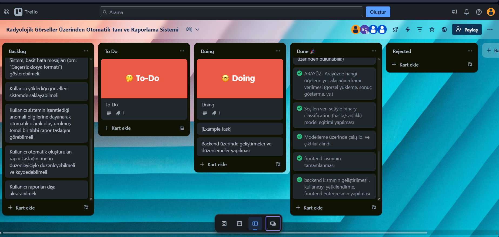

---

## Ürün Durumu (Ekran Görüntüleri)

---

##  Sprint Review

- Göğüs X-ray verileri sınıflandırılarak analiz edilmiştir.  
- Görselleştirme çıktıları başarıyla alınmış ve yorumlanmıştır.  
- LLM entegrasyonu başlatılmıştır (rapor üretimi için prompt çalışmaları yapılmıştır).  
- Hastalıklı olarak etiketlenmiş veriler üzerinde çok sınıflı (multi-class) sınıflandırma modeli eğitilmiştir.  
- Raporlama sistemine yönelik prototipleme süreci başlatılmıştır.

**Sprint Review Katılımcıları:**
- Esra Cesur  
- İclal Karahisar  
- Atakan Emir Çaldağ  
- Emir Can İpsalalı

---

## Sprint Retrospective

- Görselleştirme çıktıları, model doğruluğuyla tutarlı şekilde başarılı sonuçlar verdi.  
- Bir sonraki sprintte sistem entegrasyonu ve demo yayınına ağırlık verilecek.

  
<h2>Sprint 3</h2>

Sprint 3 kapsamında sistemin kapsamı genişletilerek sadece göğüs röntgeni değil, **diş** ve **kemik** gibi farklı anatomik bölgeler için de analiz yapılabilecek şekilde altyapı güncellenmiştir.  
Ayrıca, uygulamanın erişilebilirliğini artırmak amacıyla bir **canlı demo Hugging Face üzerinde** yayınlanmıştır.
Frontend'de kullanıcı deneyimini iyileştiren tasarım değişiklikleri yapılmış, raporlama çıktıları daha kullanıcı dostu hale getirilmiştir.

## 🗣 Daily Scrum

Günlük scrum toplantılarımız yine **WhatsApp grubu üzerinden yazılı olarak** gerçekleştirilmiştir.

## Ürün Durumu (Ekran Görüntüleri)
---
📍 **Giriş Arayüzü Ekranları**

| Login Sayfası | Request Access | Forgot Password |
|------------------|------------------|--------------------|
| 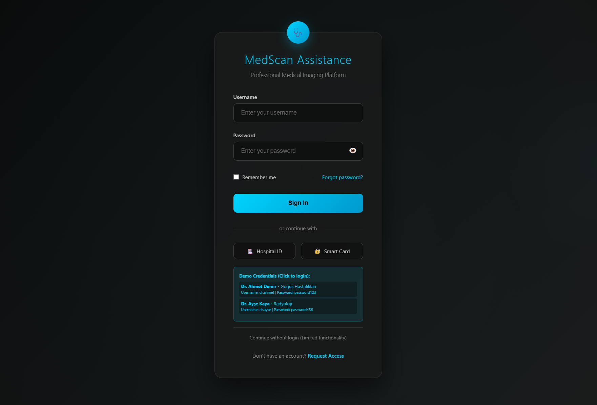 | 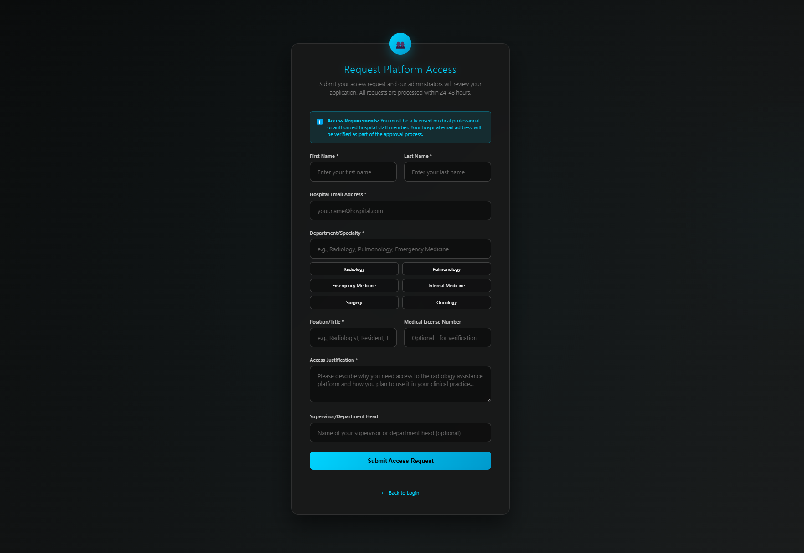 | 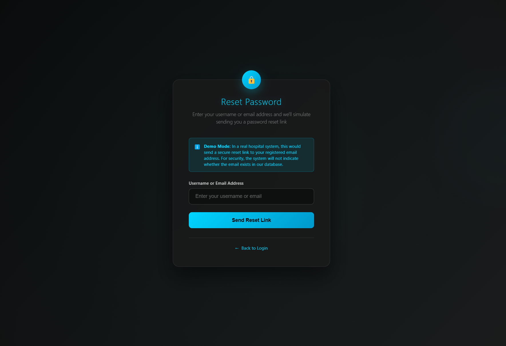 |

---

📍 **Göğüs X-Ray Sınıflandırma Sonucu:**

| Tahmin Öncesi | Tahmin Sonrası |
|----------------------|---------------------|
|  | 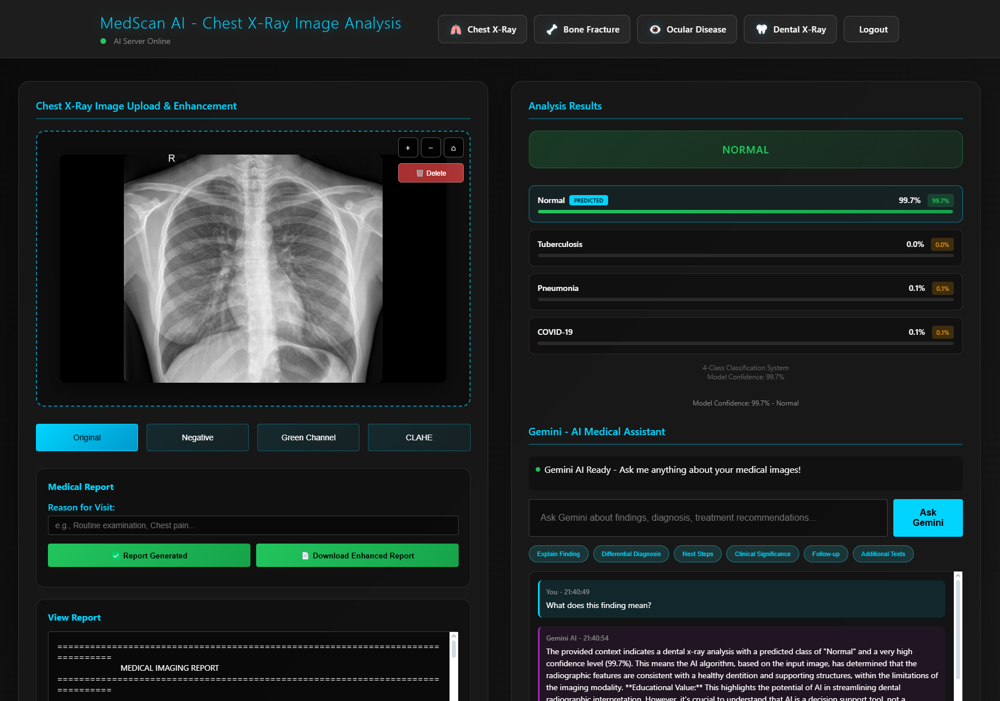 |

---

📍 **Goz Hastaliklari Siniflandirma Sonucu:**  
| Tahmin Öncesi | Tahmin Sonrası |
|----------------------|---------------------|
| 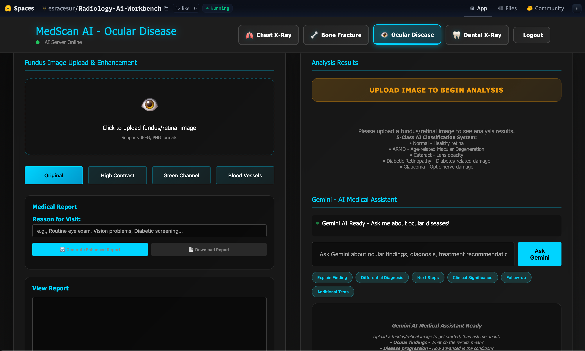 |  |

---

📍 **Diş Görüntüsü Anomali Görselleştirmesi:**  
| Tahmin Öncesi | Tahmin Sonrası |
|----------------------|---------------------|
| 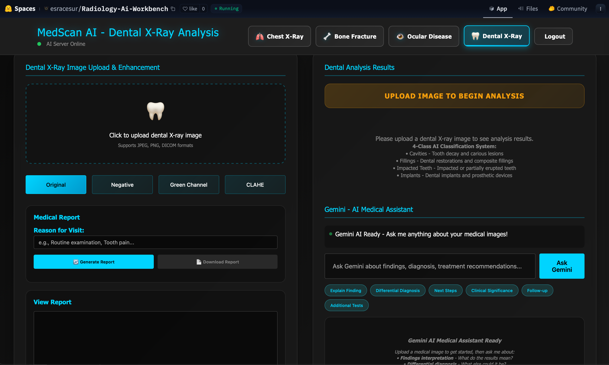 | 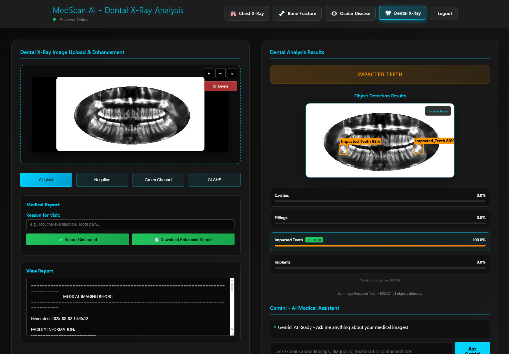 |

---

📍 **Kemik Sınıflandırma Sonucu:**  
| Tahmin Öncesi | Tahmin Sonrası |
|----------------------|---------------------|
| 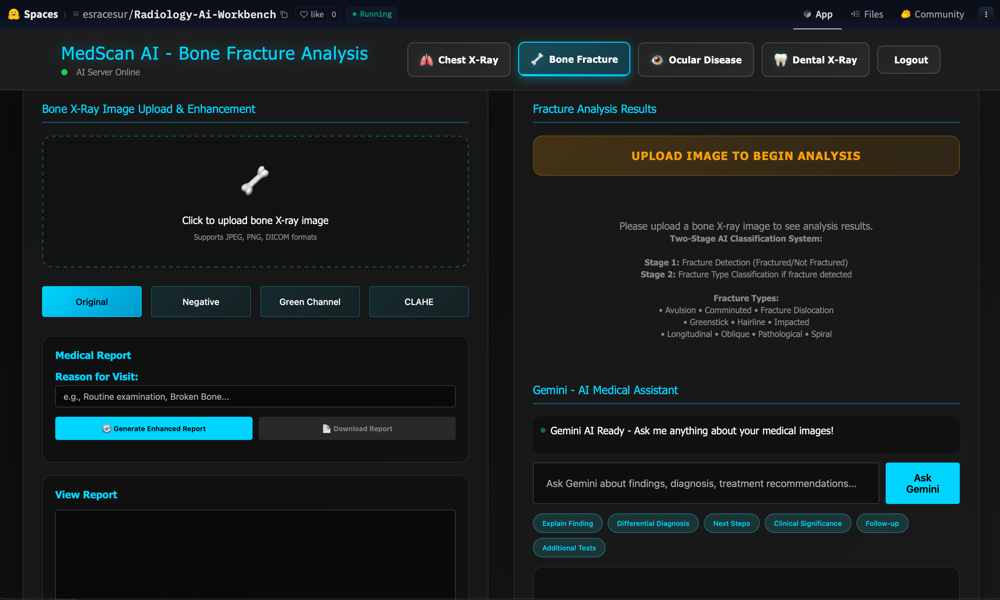 | 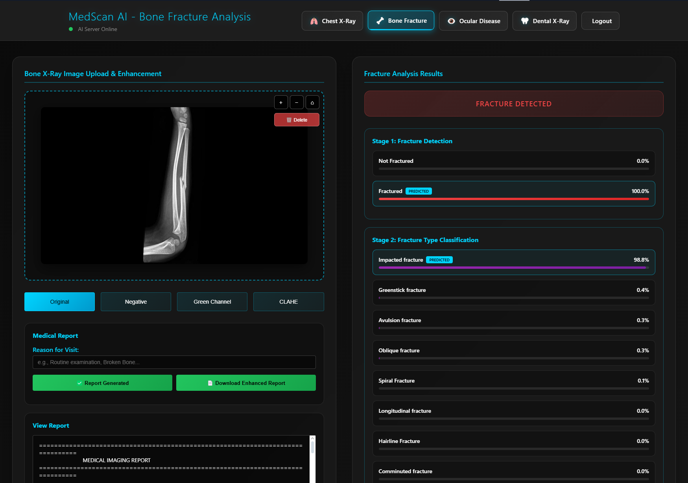 |

---

📍 **Otomatik Rapor Oluşturma Çıktıları:**  
| Göğüs Sınıflandırma Raporu | Kemik Sınıflandırma Raporu | Göz Sınıflandırma Raporu | Diş Anomali Raporu |
|------------------------------|-------------------------------|------------------------------|------------------------|
| 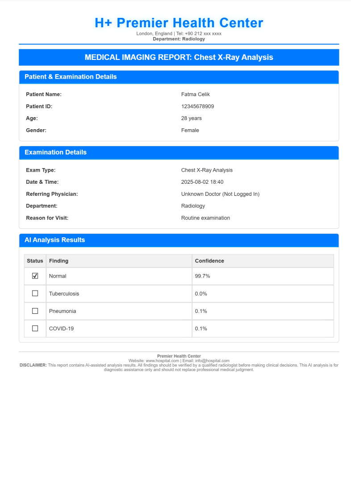 | 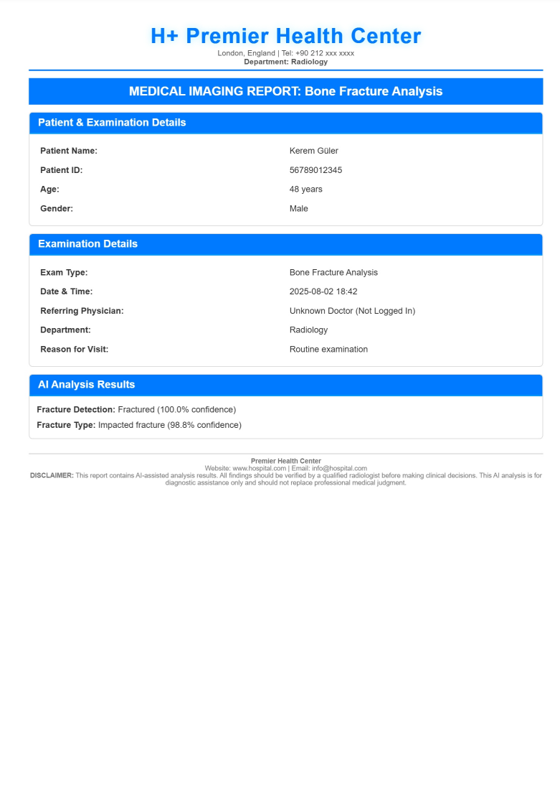 | 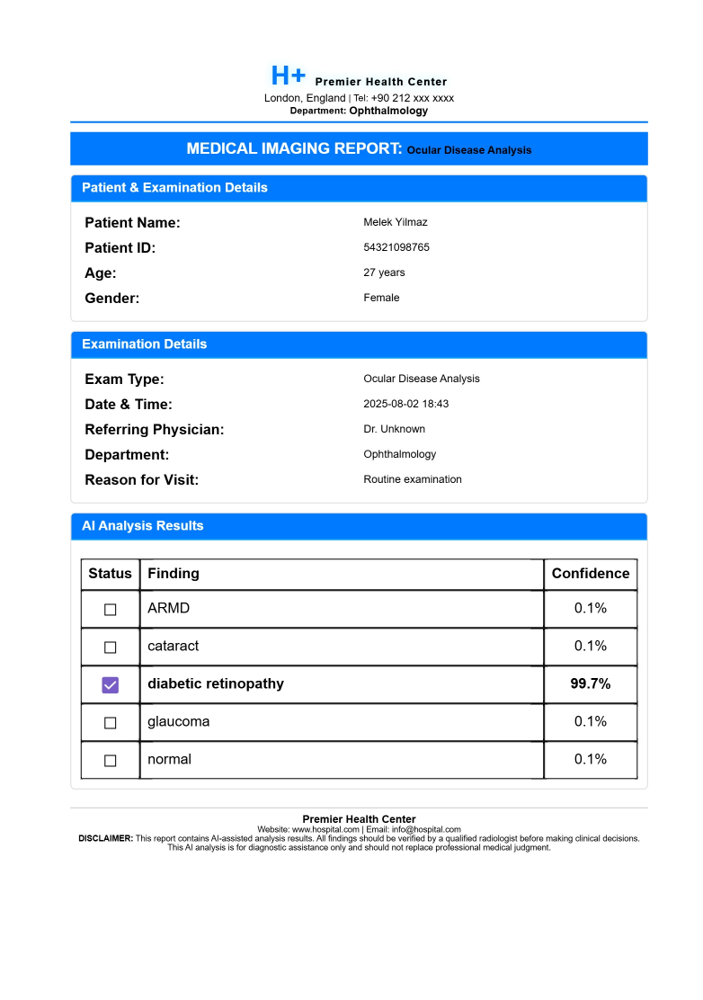 | 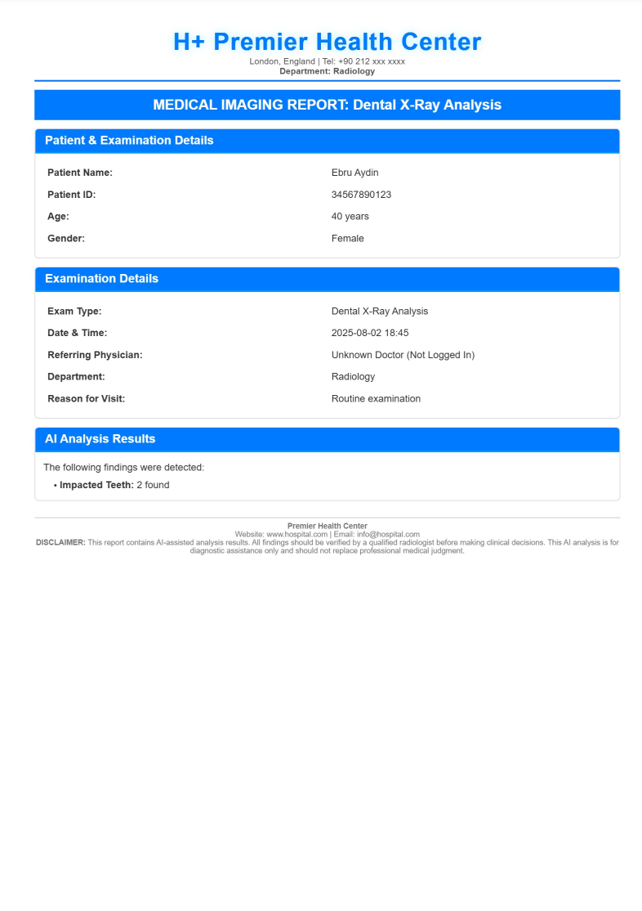 |

---

### Canlı Uygulama: Hugging Face Spaces    

Uygulama, daha geniş kullanıcı kitlesinin test edebilmesi amacıyla Hugging Face üzerinde canlıya alınmıştır. Hugging Face Spaces üzerinde tüm özellikleriyle yayınlanmıştır ve herkese açıktır.    

🔗 Website Linki: [MedScan AI - Hugging Face Spaces](https://huggingface.co/spaces/esracesur/Radiology-Ai-Workbench)   

--- 

## 🚀 Uygulama Kullanımı ve Yayın Ortamı

Proje, gerçek kullanıcı deneyimini iyileştirmek ve kullanımı daha pratik hale getirmek amacıyla, gerçek hayatta birebir karşılığı olmayan "kart numarası" ve "hastane ID" gibi giriş alanları sistemden kaldırılarak sadeleştirilmiştir.  
Bu sadeleştirme sayesinde kullanıcıların sistemi keşfetmesi, test etmesi ve öğrenmesi kolaylaştırılmıştır. Modelin yuklenmesi basarisiz olmasi durumunda gemini ai ile model analiz edilip, sistemi korumaya alinmistir.

Uygulama halen geliştirilmeye devam etmekte olup; eksik yönleri giderilerek işlevselliği artırılacaktır.

🔗 **Canlı Uygulama Adresi:**  
[http://34.78.167.90:8000](http://34.78.167.90:8000)

🔐 **Test Hesapları:**

| Rol    | TC Kimlik No   | Şifre      |
|--------|----------------|------------|
| Admin  | 12345678901    | admin123   |
| Doktor | 98765432109    | doctor123  |

📍 **Canlı Demo (in Development)**  

|  Giriş Sekmesi | Göğüs X-Ray Görüntüleme ve Raporlama |
|------------------|-----------------------------------------|
|  | 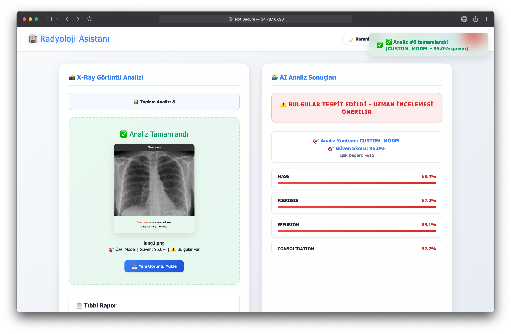 |

# Proje Dökümanı

  
<h2>Kullanılan Teknolojiler</h2>

### Backend
- **Framework**: Flask `v2.3.3`
- **AI/ML Kütüphaneleri**:
  - TensorFlow `v2.13.0`
  - PyTorch `v2.0.1`
- **Görüntü İşleme**:
  - OpenCV
  - Ultralytics YOLOv8
- **LLM Entegrasyonu**: Google Gemini AI

### Frontend
- **Template Engine**: Jinja2 + modern CSS
- **JavaScript**: Vanilla JS (ES6+)
- **PDF Oluşturma**: `html2pdf.js` ile PDF çıktısı
- **Responsive Tasarım**: Mobil öncelikli (mobile-first) yaklaşım

### Yayınlama & Ortam
- **Platform**: Hugging Face Spaces (Online)
- **Konteynerleştirme**: Docker uyumlu yapı
- **Çalışma Ortamı**: Python `v3.9+`
- **Bağımlılıklar**: Optimize edilmiş `requirements.txt`

